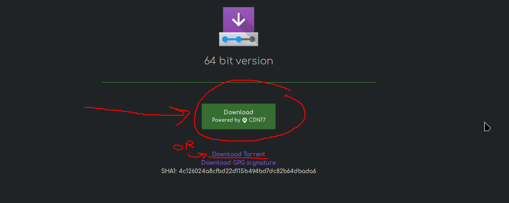
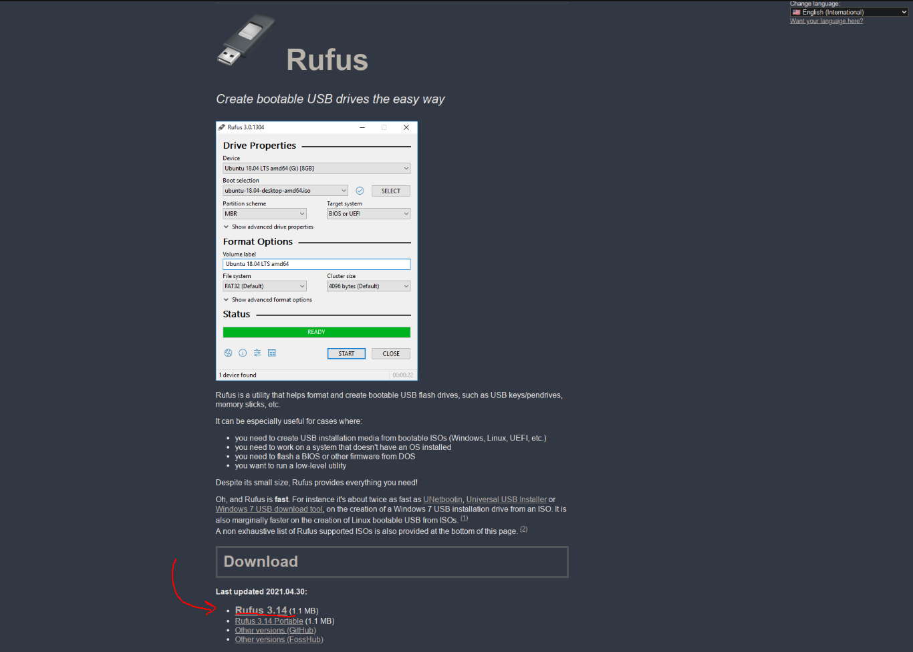

# Lets get Started

The first thing you will need to do is to download the ISO file for the Manjaro KDE Linux, the ISO file is basically a file containing in it all the Linux Operating system that we will use to install Linux on your device.

## Steps to cover

1. [Download the Manjaro Linux ISO.](#downloading-the-iso)

2. [Download the Rufus Boot-able USB Drive tool.](#downloading-the-rufus-tool)

3. [Burn the Linux ISO file into rufus.](#burning-the-linux-iso-file-on-a-usb)

## Downloading the ISO

- Use this [link](https://manjaro.org/downloads/official/kde/) to go to the download page of Manjaro Linux.

- Choose either Direct Download or Torrent, whichever works with your internet connection.

- After the download finishes, move to the next step.

## Downloading the Rufus Tool

- Go to the Rufus website [Rufus website](https://rufus.ie/en_US/)

- Download the latest update version of Rufus.

- After the download finishes, move to the next step.

## Burning the Linux ISO file on a USB

In this step you will create a Boot-able USB drive in order for you to load Linux and start the installation process.

So, for this step you will need the following:

- An empty USB drive that has at least 3GB of space.

After getting a USB drive continue the steps below:

1. Insert the USB drive into your computer

2. Start up rufus software

3. Next to the Boot section you will find an option to select the Linux file you just downloaded.

4. After Selecting the Linux file, it will auto load the configuration.

5. Click Start at the bottom.

6. After it finishes burning, you will see the green bar completed which means it is Ready.

7. While the USB is still plugged in restart your computer.

### Now you are ready for the next part

### [⇐ Home](../index.md) | [Next ⇒](./2-booting-live-usb.md)
